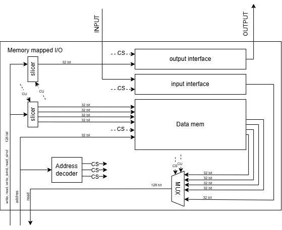
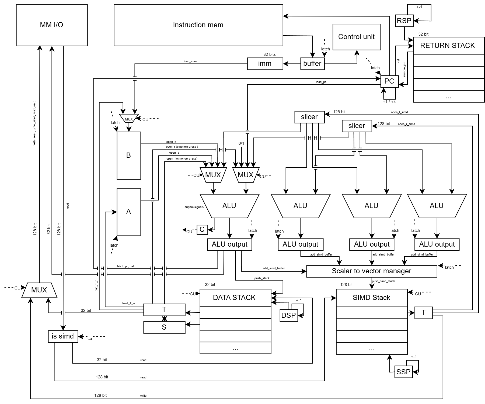
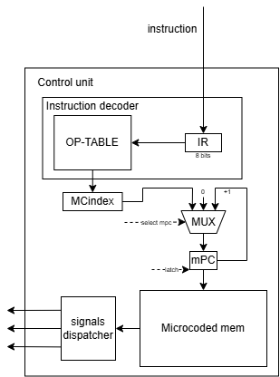

# VSS (Virtual Stack Simd)

---
#### Выполнил: Захарченко Роман Владимирович, группа Р3231, ису: 408648

Вариант: `forth | stack | harv | mc | tick | binary | stream | mem | cstr | prob2 | vector`

# Язык программирования

---


## Синтаксис

``` ebnf
program ::= sections

sections ::= section
          | section sections

section ::= import_section
         | data_section
         | func_section
         | text_section

import_section ::= _import_ <новая строка> path_list

path_list ::= path
           | path path_list

path ::= string

data_section ::= _data_ <новая строка> var_decls

var_decls ::= var_decl
           | var_decl var_decls

var_decl ::= string number "VAR" word 
          | string "VAR" word 
          | number "VAR" word 

func_section ::= _func_ <новая строка> word_def

word_def ::= ":" word terms ";"

text_section ::= _text_ <новая строка> terms

terms ::= term
       | term terms

term ::= word
      | number
      | string
      | address
      | comment
      | if_expr
      | loop_expr_while
      | begin_loop_expr

if_expr ::= "IF" terms "THEN"
         | "IF" terms "ELSE" terms "THEN"

loop_expr_while ::= "LOOP" terms "WHILE" terms "REPEAT"

begin_loop_expr ::= "BEGIN" terms "WHILE" terms "REPEAT"

address ::= "&" word

comment ::= # <любые печатные символы до переноса строки>

string ::= "<любые печатные символы>"

number ::= <целое число>
```
Подробную документацию всех команд можно посмотреть [тут](./docs/forth.md)

Примеры программ можно посмотреть вот [тут](./example)

## Семантика
- Стратегия вычислений - стековая.
- Постфиксная запись (обратная польская нотация).
- Стек данных, стек векторов — основные механизмы передачи аргументов между функциями.
- Стек возвратов — хранит адреса возврата для управления потоком выполнения.
- Forth код компилируется в язык мнемоник который кладётся в директорию build 
- Язык мнемоник транслируется в память инструкций, потом последовательно выполняется.
- Файлы можно импортировать друг в друга. Импорты являются inline вставкой функций в файл куда импортируются.
- Область видимости: все переменные и все функции доступны везде в пределах одного файла, с условием, что переменные и функции объявлены до исполняемого кода.
- Типизация слабая. Термом "<последовательность_символов>" объявляются строки, любое число определяется как знаковое. Строки, записанные не в указанном формате, трактуются как названия переменных или функций. Число может быть записано в десятичном или шестнадцатиричном формате.

# Архитектура процессора

---
## Организация памяти

Память команд и данных раздельная (Гарвардская архитектурa). 
В памяти команд сначала хранятся все функции, потом основной код программы.
Размер машинного слова - 32 бита. Адресация только прямая, но с помощью последовательного применения команды загрузки можно добиться косвенной.

### Память данных
 - Представляет собой последовательность байт адресуемых по машинному слову (32 бита в big-endian)
 - Поддерживает только абсолютную адресацию
 - Адреса 0x80 и 0x84 зарезервированные под ввод вывод

### Память инструкций
 - Первыми 4 байтами в памяти инструкций является адрес входа в программу
 - Представляет собой последовательность байт разделённую на инструкции по 1 или 5 байт в зависимости от наличия аргумента у инструкции. 
 - Процедуры хранятся рядом с основным кодом, но обязательно перед ним т.е. сначала идут все процедуры, а после этого основной код программы
 - Поддерживает абсолютную и относительную адресацию

### Регистры

- PC - program counter. Хранит указатель на ячейку с исполняемой командой. 32 бита.
- A - A register. Регистр a. 32 бита.
- B - B register. Регистр b. 32 бита.

### Стеки
Все стеки представляют собой набор регистров организованный как LIFO-буфер. Они имеют фиксированный размер, аппаратный указатель стека. 
При переполнении происходит исключение самого последнего значения.

В данной стековой машине есть 3 вида стека.
- data stack - 32-ух битный стек для вычислений, передачи переменных в функции и т.д.
- vector stack - 128-ми битный стек для векторных вычислений.
- return stack - 32-ух битный стек для хранения адресов возвратов.

### Доступные программисту ресурсы

#### Регистры, стеки, память

- Регистры общего назначения
  - A, B - регистры общего назначения (B затираемый регистр при различных загрузках и т.д.)
  - косвенный доступ к PC через операции ветвления 
- Стеки
  - data stack
  - vector stack 
- Память данных (чтение и запись)
- Память инструкций (запись)

#### Работа с памятью

Понятия константы не существует, любые данные можно изменить. 
Любому числу отведено в памяти одно машинное слово, любому символу строки отведён 1 байт -> в одно машинное слово можно записать 4 символа.
Адресация в байтах начиная с 0x0.

## Система команд

### Общие принципы:

- Обработка данных осуществляется по текущему адресу. Процессор считывает 1 байт из памяти.
- Далее считанный байт(opcode) попадает в дешифратор инструкций и если инструкция с аргументом то запрашивается ещё 4 байта и они попадают в регистр B. Сам опкод попадает в OP-ROM откуда получает адрес начала микропрограммы.
- Поток управления:
    - инкремент или увеличение на 4 `PC`
    - условный переход (`if`, `-if`).
    - безусловный переход (`jmp`, `call`)
- Адресация переходов косвенная.
- Адресация загрузок прямая.
- Поток ввода-вывода осуществляется через Memory-Mapped IO. 0x80 - ячейка ввода, 0x84 - ячейка вывода.

### Набор инструкций

Система команд относится к классу стековых архитектур с поддержкой SIMD операций. Основные особенности:
- Стековая модель вычислений
- Поддержка скалярных и векторных операций
- Фиксированный формат команд (8-битный опкод)
- Разделение на арифметико-логические, загрузки/сохранения и управления потоком команд

Все команды кодируются 8-битным опкодом (1 байт). Некоторые команды требуют дополнительного непосредственного значения (imm), которое следует сразу после опкода (4 байта).

---

**Полное описание всех доступных инструкций, их микрокода и т.д. можно найти [тут](./docs/isa.md)**

---

### Классификация системы ~~команд~~
1. **Тип архитектуры**: Стековая с регистрами A/B
2. **Организация памяти**: Гарвардская
3. **Типы операций**:
   - Скалярные
   - Векторные (SIMD)
   - Управление потоком
4. **Особенности**:
   - Единообразное кодирование (1 байт)
   - Два стека (данных/вызовов)
   - Гибридная модель выполнения

### Бинарное представление

Бинарное представление инструкций (всё представлено в big-endian)

Команда с аргументом:
```text

    ┌───────────┬───────────┬───────────┬───────────┬───────────┐
    │ 7... ...0 │ 15..  ..8 │ 23.. ..16 │ 31.. ..24 │ 39.. ..32 │
    ├───────────┼───────────┴───────────┴───────────┴───────────┤
    │   опкод   │                    аргумент                   │
    └───────────┴───────────────────────────────────────────────┘
```


Команда без аргумента:
```text

    ┌───────────┐
    │ 7... ...0 │ 
    ├───────────|
    │   опкод   │ 
    └───────────┘
```

Подробнее про все команды, их коды и их микропрограммную реализацию можно посмотреть тут 
[инструкции](./src/stack_machine/config/instructions.yaml),
[микропрограммы](./src/stack_machine/config/mc.yaml)


# Запуск

---


Для языка forth была разработана системы компиляции и ассемблирования программы в машинный код. 
Сам компилятор делится на 2 части. 
  1. Компилятор Forth кода в язык мнемоник
  2. Ассемблер языка мнемоник в байт-код.

Далее уже запускается стековая машина с указанием бинарных файлов инструкций и данных

## Компилятор 

---

### Интерфейс

Входные данные: имя файла .forth с текстом программы

Выходные данные: файл code с программой на языке мнемоник 

Пример запуска: `python3 -m src.code_compiler.compiling.compiling arrays.forth`

После запуска рядом с файлом forth появится папка build где будет лежать файл `code` с скомпилированной программой в язык мнемоник

### Компиляция

Процесс компиляции состоит из 3 этапов:
  1. Парсинг каждой секции - на этом этапе все секции одного типа объединяются для последующей компиляции
  2. Компиляция каждой из секций - на этом этапе происходит компиляция всех секций в определённом порядке: `_import_`, `_data_`, `_func_`, `_text_`
     такие блоки как `_import_` рекурсивно компилируют своё содержимое однако используя для переменных другое адресное пространство.  
      - Перевод базовых команд в мнемоники (`+` -> `+`, `0` -> `push_imm 0` и т.д.)
      - Разрешение сложных конструкций таких как циклы и ветвление по заготовленным заранее [шаблонам](./src/code_compiler/compiling/app/samples). 
        Данные шаблоны заранее составленными для общих случаев циклов или ветвелний 
  3. Перестановка секций в нужном порядке и запись в результирующий файл - на этом этапе результаты компиляции записываются в
     файл в определённом порядке, сначала идёт секция `.data` далее `.text` в котором идут сначала все скомпилированные функции, потом метка `_start`
     Показывающая место входа в программу и уже потом основная программа.

## Асемблер

---

### Интерфейс

Входные данные: файл с текстом программы на языке мнемоник и числовое значение размера памяти данный в байтах.

Выходные данные: бинарный файл в формате 

```text

    ┌────────────────┬──────────────┬──────────────┬───────────┬───────┬────────┬────────────────┐
    │    32 bits     │    32 bits   │    32 bits   │  .......  │ ..... │ 32 bit │    .......     │
    ├────────────────┼──────────────┼──────────────┼───────────┼───────┼────────┼────────────────┤
    │ clusters count │ cluster size │ cluster addr │  cluster  │       │ _start │  instructions  │
    └────────────────┴──────────────┴──────────────┴───────────┴───────┴────────┴────────────────┘
```
- `clusters count` - количество кластеров данных
- `cluster size` - размер одного кластера
- `cluster addr` - адрес одного кластера
- `cluster` - адрес одного кластера
- `_start` - адрес входа в программу
- `instructions` - все остальные инструкции и их операнды

Пример запуска: `python3 -m src.code_compiler.assembly.assembly code 100`

После запуска рядом с файлом `code` появится папка `bin` в которой будут лежать 2 файла `instruction_memory` и `data_memory` в которых будут находиться инструкции и данные в бинарном фиде соответственно.

### Ассемблирование

На этапе ассемблирования команда преобразует мнемоники, описанные в секции `.text`, в машинный код с использованием [конфигурации инструкций](./src/code_compiler/config/instructions.yaml). При обнаружении метки `_start` её адрес записывается в первое машинное слово памяти инструкций как точка входа программы.

Каждая инструкция занимает 1 байт, за ней следует аргумент длиной 4 байта, если он предусмотрен данной инструкцией.

Данные, описанные в секции `.data`, размещаются в бинарном файле памяти данных. Поддерживаются два типа записи:

- `word` — запись значения в 4 байта;
- `byte` — запись значения в 1 байт.


## Модель процессора

---
Входные данные: путь к бинарным, сгенерированному компилятором, путь к конфигу .yaml, где описаны io, логи, ассерты

Пример запуска:
`
python3 -m src.stack_machine.start_cpu -c arrays.yaml -b ecex.bin
`

Ключ `-с` указывает на то что файл является файлом конфигурации

Ключ `-b` указывает на то что файл является бинарным файлом программы

Пример файла конфигурации можно найти [тут](./example/arrays/arrays.yaml)

Правила написания конфигурации можно найти [тут](./docs/сonfiguration_rules.md)

### Cхема 
#### DataPath
Схема Memory mapped I/O 



где:
- slicer - преобразователь 128 битной шины в четыре 32 битные или одну 32 битную
посредством отсечения лишних данных
- output/input interface - интерфейс взаимодействия с внешними устройствами
- address decoder - декодер адреса который проверяет являться ли переданный адрес адресом ввода или вывода
- data mem - память данных 

Для возможности за один так забрать сразу 4 слова было принято решение сделать 128 битную шину данных с возможностью работать 
в 32 битном режиме, что изображено на схеме

Схема основных элементов DataPath



где:
- MM I/O - память данных с отображёнными туда портами ввода вывода 
- instruction mem - память инструкций 
- control unit - unit отвечающий за декодирование инструкций в микрокод, а после в набор сигналов
- регистры A, B - регистры общего назначения
- slicer - слайсер 128 битной шины на четыре 32 битных шины для работы с векторами
- alu x4 - арифметическое логическое устройство
- DATA stack - 32 битный стек данных для работы с обычными машинными словами 
- SIMD stack - 128 битный стек данных для работы с векторами из 4 машинных слов и менее
- RETURN stack - 32 битный стек для адресов возврата
- PC - program counter
- Scalar to vector manager - менеджер сбора четырёх 32 битных шин в одну 128 битую
- ALU output - это промежуточное обозначение результата вычисления alu (по сути является частью alu)
- DSP, SSP, RSP - stack pointers data stack-a, simd stack-a и return stack-a соответственно
- T, S - обозначение верха стека и второго элемента соответствующего стека
- C - carry flag
- MUX - мультиплексоры
- imm и buffer - это просто обозначения для удобства, они НЕ являются регистрами 
- на шинах можно встретить подписи битности данных шин (так же подписи сигналов которые протекают по этим шинам,
но это больше сделано для удобства понимания схемы) 
### ControlUnit
Схема основных элементов Control unit



где:
- IR - это 8 битный регистр инструкции
- OP-TABLE - ROM память, где хранятся зависимости адреса начала микропрограммы от опкода инструкции
- MCindex - адрес начала микропрограммы
- mPC - microcode program counter
- Microcode mem - ROM память микрокоманд с словом в 32 бита
- signals dispatcher - диспетчер сигналов


**Общую схему всех частей можно посмотреть вот [тут](./docs/schema/schema.png).**

### Особенности работы модели:

---

Главной особенностью данной модели является реализация векторных операций с помощью SIMD (Single instruction multiply data) архитектуры процессора, 
из-за чего работа по сложению например четырёх чисел падает с 4 тактов до 1. Было сделано 4 ALU а также разширины шины общения с памятью для возможности одновременной загрузки сразу нескольких машинных слов. Подробнее можно увидеть на схеме.   

## Тестирование

---

Были разработаны тесты в формате golden тестов.

### golden tests

1. **[cat](./tests/golden/cat)** test - вывести введёную строку
2. **[hello](./tests/golden/hello)** test - вывести "hello world"
3. **[hello user name](./tests/golden/hello_user_name)** test - вывести вопрос "What is your name?" пользователь вводит своё имя и после этого вывести "Hello, <имя пользователя>"
4. **[prob2](./tests/golden/prob2)** test - пользователь вводит число n, программа должна посчитать и вывести разность квадрата суммы и суммы квадратов всех чисел до n
5. **[sort](./tests/golden/sort)** test - пользователь вводи массив, программа должна его отсортировать и вывести назад
6. **[arrays](/tests/golden/sort)** test - в программе заданы два массива с помощью синттаксиса задания массивов, программа должна сложить элементы попарно этих 2 массива и вывести результирующий массив
7. **[ssm](./tests/golden/ssm)** и **[vsm](./tests/golden/vsm)** tests - эти 2 теста получают на вход 2 массива и должны сложить элементы попарно и вывести результирующий массив однако тест `ssm` делает это с помощью скалярных операций, а тест `vsm` с помощью векторных.

    С помощью этих тестов виден выйгрыш работы с массивами с помощью векторных операций... около 200 тактов на сложении двух массивов из 8 элементов.

    Выйгрыш в векторных операциях когда например надо сложить 8 чисел попарно:

   - Скалярно: 8 тактов (загрузка 8 чисел) + 4 такта (запись 4 результатов) + 4 такта (сложение попарно 4 чисел) = 16 тактов
   - Векторно: 4 такта (загрузка 2 векторов по 2 такта каждый) + 1 такт (сложение 2 веторов) + 4 такта (запись 2 векторов, по 2 такта на каждый) = 9 тактов

    Итого выйгрыш почти в 2 раза, а если быть точнее в 1,7 раза. 

